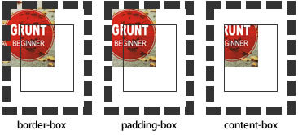
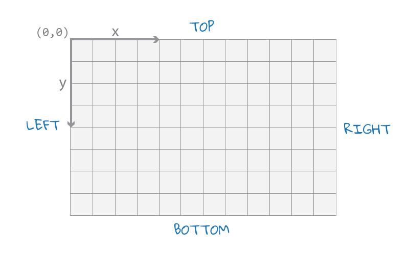
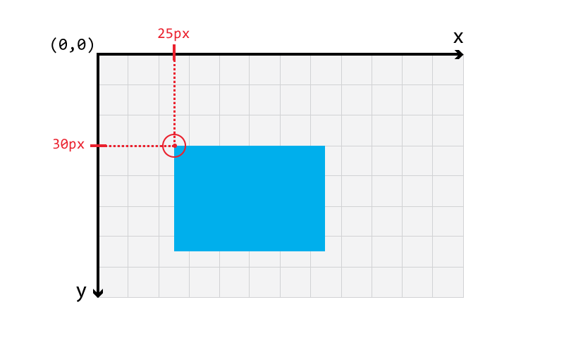

# background相關屬性大攻略

## background

CSS簡寫屬性，可以用來設置以下一個或多個屬性，順序任意。
```scss
// 預設值:
background-image     : none;
background-position  : 0% 0%;
background-size      : auto auto;
background-repeat    : repeat;
background-origin    : padding-box;
background-clip      : border-box;
background-attachment: scroll;
background-color     : transparent;
```


## background-attachment

If a [`background-image`](https://developer.mozilla.org/en-US/docs/Web/CSS/background-image) is specified, the **background-attachment** [CSS](https://developer.mozilla.org/en-US/docs/CSS) property determines whether that image's position is fixed within the viewport, or scrolls along with its containing block.

### syntax

```scss
background-attachment: scroll;
background-attachment: fixed;
background-attachment: local;

background-attachment: inherit;
```

### value

#### fixed

背景圖像相對於瀏覽器視窗固定。 

背景圖只能出現在它父元素能達到的區域。即使圖片是相對於視口(view port)定位地，如果它的父元素不可見，圖片就會消失。

#### scroll

背景圖像相對於元素固定，也就是說當元素內容滾動時背景圖像不會跟著滾動，因為背景圖像總是要跟著元素本身。但會隨元素的祖先元素或窗體一起滾動。 

#### local

背景圖像相對於元素內容固定，也就是說當元素隨元素滾動時背景圖像也會跟著滾動，同時背景圖像的大小也是跟著內容改變，也就是說可以往下 scroll越多的元素，背景圖片越大。（現在只有 chrome支援，還很不普及。）


## background-clip

決定背景圖或背景顏色的顯現範圍。

預設值是 `background-clip: border-box;`

### syntax

```scss
background-clip: border-box;
background-clip: padding-box;
background-clip: content-box;
```



## background-repeat

If a background image is specified, the `background-repeat` property defines whether the image is repeated (tiled), and how.

Repeating a background image happens after it has been [sized](http://tympanus.net/codrops/css_reference/background-size) and [positioned](http://tympanus.net/codrops/css_reference/background-position).

### syntax

```scss
/* 單值語法 */

background-repeat: repeat;
background-repeat: space;
background-repeat: round;
background-repeat: no-repeat;
background-repeat: repeat-x;
	// 上面代表 background-repeat: repeat no-repeat;
background-repeat: repeat-y;
	// 上面代表 background-repeat: no-repeat repeat;

/* 雙值語法: 水平horizontal | 垂直vertical */
background-repeat: repeat space;
background-repeat: repeat repeat;
background-repeat: round space;
background-repeat: no-repeat round;

background-repeat: inherit;
```

### value

#### repeat

圖像會按需重複來覆蓋整個背景圖片所在的區域. 最後一個圖像會被裁剪, 如果它的大小不合適的話.

#### space

圖像會儘可能得重複, 但是不會裁剪. **第一個和最後一個圖像會被固定在起點和終點的邊上, 同時空白會均勻地分佈在圖像之間.** 

[`background-position`](https://developer.mozilla.org/zh-CN/docs/Web/CSS/background-position)屬性會被忽視, 除非只有一個圖像能被無裁剪地顯示，只在一種情況下裁剪會發生, 那就是圖像太大了以至於沒有足夠的空間來完整顯示一個圖像.

#### round

當前 browser還沒有廣泛支持

隨著允許的空間在尺寸上的增長, 被重複的圖像將會伸展(沒有空隙), 直到有足夠的空間來添加一個圖像. 當下一個圖像被添加後, 所有的當前的圖像會被壓縮來騰出空間. 例如, 一個圖像原始大小是260px, 重複三次之後, 可能會被伸展到300px, 直到另一個圖像被加進來. 這樣他們就可能被壓縮到225px.

譯者註: 關鍵是瀏覽器怎麼計算什麼時候應該添加一個圖像進來, 而不是繼續伸展.

#### no-repeat

圖像不會被重複(因為背景圖像所在的區域將可能沒有完全被覆蓋). 那個沒有被重複的背景圖像的位置是由[`background-position`](https://developer.mozilla.org/zh-CN/docs/Web/CSS/background-position)屬性來決定.


## background-origin

規定了指定背景圖片[`background-image`](https://developer.mozilla.org/zh-CN/docs/Web/CSS/background-image) 的 **background positioning area**，即是背景圖片的渲染區域。

預設值是 `bakcground-origin: padding-box;`

注意：當使用 [`background-attachment`](https://developer.mozilla.org/zh-CN/docs/Web/CSS/background-attachment) 為fixed時，該屬性將被忽略不起作用。


### syntax

```scss
background-origin: border-box
background-origin: padding-box 
background-origin: content-box
```

### value

#### border-box

背景將會延伸到延伸到外邊界的邊框，但是**邊框在上，背景在下**，這個用border-style 為dashed可以直接看得出來。

#### padding-box （此為預設值）

背景描繪在padding盒子，邊框裡不會有背景出現。同樣，背景將會延伸到最外邊界的padding.

#### content-box

背景描繪在內容區範圍.


## background-position

指定背景圖片的初始位置，這個位置是相對於 background-origin定義的 **background positioning area**。

預設值是 `background-psotion: 0% 0%;`



### value

有兩大表示方式：1. length表示 2. percentage表示 3. 文字表示

#### length



上圖代表 `background-position: 30px 25px;`

#### percentage


上圖代表 `background-posiotion: 50% 75%;`

#### 文字表示

```scss
// When only one offset value is specified, the second value is assumed to be center. 
// Example 1:
background-position: top;
// is equal to 
background-position: top center;
background-position: center top;
background-position: 50% 0%
// Example 2:
background-position: left;
// is equal to 
background-position: left center;
background-position: 0% 50%;

// Other Examples
background-position: 20px; 
background-position: 20px 50px; 
background-position: 30% 75%;
background-position: top left; 
background-position: top 100px; 
background-position: -300px 45px; /* 300px to the left and 45px downwards */
```


## background-size

The `background-size` property is used to specify the size of background images.

**Note:** If the value of this property is not set in a [`background`](https://developer.mozilla.org/en-US/docs/Web/CSS/background) shorthand property that is applied to the element after the `background-size` CSS property, the value of this property is then reset to its initial value by the shorthand property.

### syntax

```scss
/* Keywords syntax */
background-size: cover;
background-size: contain;

/* One-value syntax */
/* the width of the image (height set to 'auto') */
background-size: 50%;
background-size: 3em;
background-size: 12px;

/* Two-value syntax */
/* first value: width of the image, second value: height */
background-size: 50% auto;
background-size: 3em 25%;
background-size: auto 6px;
background-size: auto auto;

/* Multiple backgrounds values by background-image */
/* Do not confuse this with background-size: auto auto */
background-size: auto, auto;
background-size: 50%, 25%, 25%;
background-size: 6px, auto, contain;

/* Global values */
background-size: inherit;
background-size: initial;
background-size: unset;
```

### values

#### auto 

按照背景圖片本身原本大小與比例。

#### `<percentage>`

A `<percentage>` value that scales the background image in the corresponding dimension to the specified percentage of the **background positioning area**, which is determined by the value of **background-origin**. 

The background positioning area is, by default, the area containing the content of the box and its padding; the area may also be changed to just the content or to the area containing borders, padding, and content. 

If the background's attachment is fixed, the background positioning area is instead the entire area of the browser window, not including the area covered by scrollbars if they are present. Negative percentages are not allowed.

#### contain

等比例縮放背景圖片以完全裝入背景區，若有設置 background-repeat: no-repeat的話，可能背景區部分空白。

A keyword that scales the image as large as possible and maintains image aspect ratio (image doesn't get squished). Image is letterboxed within the container. 

#### cover

等比例縮放背景圖片以完全覆蓋背景區，部分背景圖片會被裁切。

A keyword that is the inverse of contain. Scales the image as large as possible and maintains image aspect ratio (image doesn't get squished). The image "covers" the entire width or height of the container. When the image and container have different dimensions, the image is clipped either left/right or top/bottom.