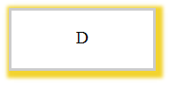
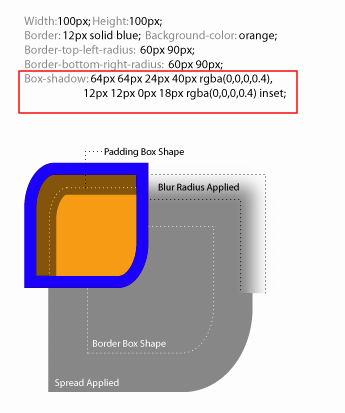
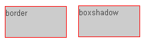
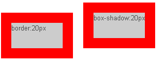
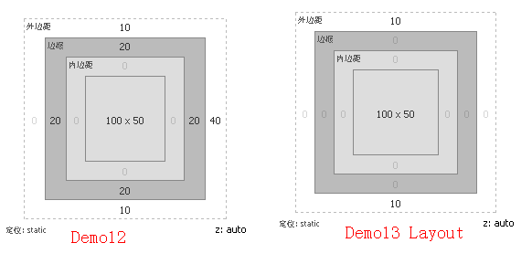

# box-shadow

## 語法設定

一組陰影的完整設定是：

```scss
E {box-shadow: inset x-offset y-offset blur-radius spread-radius color}
/*
  inset：內陰影
  h-shadow：水平位移距離
  v-shadow：垂直位移距離
  blur-radius：模糊半徑
  spread-radius：擴散距離
  color：顏色
*/
```

基本上使用 box-shadow 時最少得要提供 h-shadow 及 v-shadow。

box-shadow可以使用一個或多個投影，如果使用多個投影時必須需要用逗號「，」分開。

## 屬性說明

### 水平與垂直移動

```scss
.sth {
	box-shadow: 3px 3px #f3d42e;
}
```


### 模糊半徑

非必要，但其值只能是為正值，若其值為0時，表示陰影不具有模糊效果，其值越大陰影的邊緣就越模糊；

```scss
.sth {
  box-shadow: 3px 3px 5px #f3d42e;
}
```


### 擴散半徑

```scss
.sth {
  box-shadow: 3px 3px 0 5px #f3d42e;
}
```


### 模糊加擴散

```scss
.sth{
  box-shadow: 3px 3px 5px 5px #f3d42e;
}
```



### 無設定位移

```scss
.sth{
  box-shadow: 0 0 15px 5px #f3d42e;
}
```


### 加上 insert參數，內陰影

```scss
.sth{
  box-shadow: inset 3px 3px #f3d42e ;
  // 第一個 3px表示由左向右 3px，負數相反
  // 第二個 3px表示由上往下 3px，負數相反
}
```


### insert加上模糊與擴散

```scss
.sth{
  box-shadow: inset 3px 3px 5px 5px #f3d42e;
}
```


## shadow 運作機制



這張圖可以告訴我們很多信息，比如說borer-radius圓角，陰影擴展、陰影模糊以及padding是如何影響對象陰影的：非零值的border-radius將會以相同的作用影響陰影的外形，但border-image不會影響對象陰影的任何外形；對象陰影同box模型的層次一樣，外陰影會在對象背景之下，內陰影會在邊框之下背景之上。

> 所以整個層級就是：邊框 > 內陰影 > 背景圖片 > 背景顏色 > 外陰影。因為大家都知道，我們的背景圖片是在背景顏色之上的。

### 個別設定四個方向的陰影

```scss
.dome2 {
   box-shadow: -2px 0 0 green, //左邊陰影
   0 -2px 0 blue, //頂部陰影
   0 2px 0 red, //底部陰影
   2px 0 0 yellow; //右邊陰影
 }
```


上例中，給對象四邊設計陰影，我們是通過改變x-offset和y-offset的正負值來實現，其中x-offset為負值時，生成左邊陰影，為正值時生成右邊陰影，y-offset為正值是生成底部陰影，為負值時生成頂部陰影。並且把模糊半徑設置為0，如果不設置為0的話那麼其他三邊也將會有陰影，並且此處還涉及到一個多陰影的順序問題。

### 單一元素設置多個陰影

當給同一個元素使用多個陰影屬性時，需要注意它的順序，最先寫的陰影將顯示在最頂層。

```scss
.demo{
   box-shadow: -2px 0 0 5px green,0 -2px 0 5px blue,0 2px 0 5px red,2px 0 0 5px yellow;
}
```


## 範例

### box-shadow模擬 border

```scss
  /*邊框效果*/
  .left {
    border: 1px solid red;
  }
  /*陰影效果*/
  .right {
    box-shadow: 0 0 0 1px red;
  }
```




實際上利用box-shadow來製作邊框，只能說看上去像邊框，但實質其並非邊框，他和border還是有本質上的區別。從上面的效果圖中我們明顯的可以看出左邊的box要比右邊的box低那麼1px的，這樣一來隨著其擴展半徑值越大，兩者之間的相差就更大，如：

```scss
.left-20 {
   border: 20px solid red;
 }
	
 .right-20 {
   box-shadow: 0 0 0 20px red;
 }
```






由兩者layout圖，可以得知陰影不會影響任何頁面佈局：demo12的邊框被計算了寬度，但demo13的陰影瀏覽器卻忽略不計，所以借住這個特點，我們陰影所模擬的邊框理可以自由的使用，但必須要注意其層級關係。

## 資料來源

[box-shadow區塊陰影](http://abgne.tw/css/css3-lab/css3-box-shadow.html)

