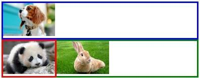

# Float

## 參考資料來源

[CSS浮動float詳解](http://www.jianshu.com/p/07eb19957991#)

[詳解CSS float屬性](http://luopq.com/2015/11/08/CSS-float/)

浮動float的本意是什麼呢？是：**讓文字像流水一樣環繞浮動元素。**

## float 特性

### 包裹性



```html
<div style="border:4px solid blue;">
    
</div>
<div style="border:4px solid red;float:left;">
    
</div>
<div style="border:4px solid green;">
     
</div>
```

block元素預設 width 是 100%，但套上 float 後，會像 inline-block 元素一樣，寬度會跟隨內容自適應。（這也是通常float元素需要手動指定width的原因）。

### 與 inline-block 差異

float: left 的效果與 inline-block 類似，差別在於 float 能設定為左或右，但 display:inline-block 一律從左到右排。兩個display:inline-block間會有空隙，但兩個float間沒有。

### 高度欺騙性

上面範例的 float 被設在了外圍 div 上，因此沒體現出高度欺騙性。現在改在裡面的 img 元素設定 float：


```html
<div style="border:4px solid blue;">
    
</div>
<div style="border:4px solid red;">
    
</div>
```

外層紅色 div 沒有了浮動，默認 width 是 100%。

裡面的 img 加了 float，讓該 img 的 inline-height 塌陷為 0 。這樣外層紅色 div 在計算高度時，認為 img 的高度為 0，相當於 div 的 content 高度為 0，因此紅色邊框看起來是一條直線。


div 中加一點文字，可以更請清楚看出效果：


div 的高度就是文字的匿名 inline-box 的 inline-height。

float 並不是讓元素的高度塌陷了，而是讓元素具有高度塌陷的欺騙性，元素自身還是有高度的（見上圖的黃框）。

### float 屬性的本意

替上面的紅色 div 加上 width: 200px;，並多加一點文字。


## float 佈局問題


```html
<ul>
    <li style="width:138px; margin:0 10px; text-align: center; float:left;">
        <div>尼古拉斯.旺財</div>
    </li>
    <li style="width:138px; margin:0 10px; text-align: center; float:left;">
        <div>功夫熊貓</div>
    </li>
    <li style="width:138px; margin:0 10px; text-align: center; float:left;">
        <div>月野兔</div>
    </li>
    <li style="width:138px; margin:0 10px; text-align: center; float:left;">
        <div>貓女郎</div>
    </li>
</ul>
```

每個 li 都設為 float 和限制的 width，實現了水平佈局。但如果好友名字太長呢？效果如下：


### 修正方案一：固定高度

把每一個 li 設定一個固定高度，然後隱藏超出的內容。

### 修正方案二：高度自適應

float:left 替換成display: inline-block ，li 加上 vertical-align: top。

但是相比 float，display:inline-block 中間會有空隙，要解決這個問題需要特別 hack。

## 清除浮動

### clear

最需要記住的是，clear 僅作用於當前元素。

### 閉合浮動

方法有很多，在此提供一個可以說是最好的：

用 :after 偽元素，思路是用 :after 元素在 div 後面插入一個隱藏文本」.」，隱藏文本用clear來實現閉合浮動：

```html
<div style="border:4px solid blue;" class="clearfix">
    <div style="width:200px; border:4px solid red; float:left;">
        我是浮動元素1
    </div>
    <div style="width:200px; border:4px solid yellow; float:left;">
        我是浮動元素2
    </div>
</div>
<div style="border:4px solid gray;">我是頁腳</div>
```

```scss
.clearfix:after {
    clear: both;
    content: ".";   // 你頭可以改成其他任意文本如「abc」
    display: block; // 使生成的元素以塊級元素顯示,佔滿剩餘空間;
    height: 0;      // 高度為0且hidden讓該文本徹底隱藏
    visibility: hidden;
}
.clearfix {
    *zoom: 1;
}
```


這個方法很不錯，就是相比上面的方法，理解起來稍微有一點點難度。但也僅增加一點點而已。