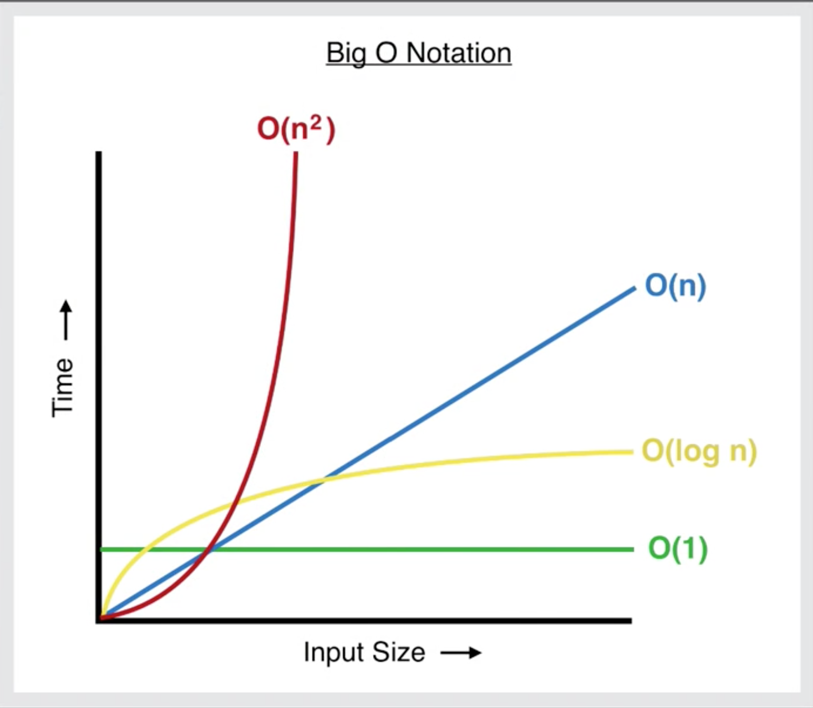

# Big O Notation, Time Complexity 衡量程式碼效率

同樣的需求，
可能可以寫出很多種不同的 function 來解決，
那我們如何決定哪一種解法比較好呢？
Big O 與 Time Complexity 便是用來衡量 function 運行效率的兩種指標。

我們通常根據
" 輸入函式的資料量增加時，執行時間會拉長多少？ "
來作為衡量效率的標準

> Big O Notation 代表演算法時間函式的上限（Upper bound），表示在最壞的狀況下，演算法的執行時間不會超過 Big-Ο。 

## Constant Run Time, `O(1)`

這個演算法（函式）的執行時間不會隨著輸入資料量的增加而增加。

```javascript
let arr1 = [1,2,3,4,5]
let arr2 = [1,2,3,4,5,6,7,8,9,10]

/**
 * Constant Run Time：不會隨著輸入的資料量越大而使得執行時間變長
 * Big O Notation: "O(1)"
 **/
function log (arr) {
  console.log(arr[0])
  console.log(arr[1])
}
log(arr1)    // 1, 2
log(arr2)    // 1, 2
```

## Linear Run Time, `O(n)`

輸入資料越多，
執行時間會等比例增加

```javascript
let arr1 = [1,2,3,4,5]
let arr2 = [1,2,3,4,5,6,7,8,9,10]

/**
 * Linear Run Time: 隨著資料量的增加，執行時間會等比增加
 * Big O Notation: "O(n)"
 **/
function logAll(arr) {
  for (let item of arr) {
    console.log(item)
  }
}

logAll(arr1)  // 1, 2, 3, 4, 5
logAll(arr2)  // 1, 2, 3, 4, 5, 6, 7, 8, 9, 10
```

## Exponential Run Time, `O(n^2)`

隨著輸入資料的增加，
執行時間呈現指數增長。

```javascript
let arr1 = [1,2,3,4,5]
let arr2 = [1,2,3,4,5,6,7,8,9,10]

/**
 * Exponential Run Time:  隨著資料量的增加，執行時間會誇張的增長
 * Big O Notation: "O(n^2)"
 **/
function addAndLog (arr) {
  for (let item of arr) {
    for (let item2 of arr) {
      console.log ('First', item + item2)
    }
  }
}
addAndLog(arr1)  // 輸出 25 筆結果
addAndLog(arr2)  // 輸出 100 筆結果
```

## Logarithmic Run Time, `O(log n)`

隨著資料量增加，
執行時間雖然會增加，
但增加率是越來越低的。

```javascript
let arr1 = [1,2,3,4,5]
let arr2 = [1,2,3,4,5,6,7,8,9,10]

/**
 * Logarithmic Run Time: 隨著資料量增加，執行時間雖然會增加，但增加率會趨緩
 * Big O Notation: "O (log n)"
 **/
function binarySearch (arr, key) {
  let low = 0
  let high = arr.length - 1
  let mid
  let element
  
  while (low <= high) {
    mid = Math.floor((low + high) / 2, 10)
    element = arr[mid]
    if (element < key) {
      low = mid + 1
    } else if (element > key) {
      high = mid - 1
    } else {
      return mid
    }
  }
  return -1
}

console.log(binarySearch(arr1, 3))
console.log(binarySearch(arr2, 3))
```

## illustration

