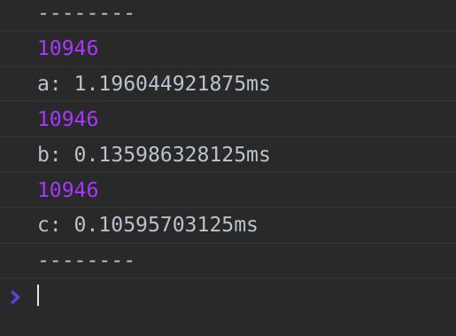

# Fibonacci

## Concept

```javascript
// return the num at the position of Fibonacci Sequence
function fibonacci (position) {
    ...
}
    
```

Fibonacci Sequence: 1, 1, 2, 3, 5, 8, 13 ...

輸入一個位置，
return 對應 Fibonacci Sequence 該位置的數字

## Solution Code

```javascript
const fibonacci = index => {
    if (index < 0) {
        return null;
    } else if (index < 2) {
        return 1;
    } else {
        return fibonacci(index - 1) + fibonacci(index - 2);
    }
};
```

## Code from `Learning Algorithms`

```javascript
// 課程中把 Fibonacci Sequence 第一位的 position 當作 1
function fibonacci(position) {
  if (position < 3) return 1;
  else return fibonacci(position - 1) + fibonacci(position - 2);
}
 
fibonacci(6);
```

## Another Solution

**特別指出** ：[0](https://www.wikiwand.com/zh-tw/0) 不是第一項，而是第零項。

```javascript
  const fibonacci = idx => (idx === 0 || idx === 1)
    ? idx
    : fibonacci(idx - 1) + fibonacci(idx - 2)

  console.log('--------')
  console.log(fibonacci(0))
  console.log(fibonacci(1))
  console.log(fibonacci(2))
  console.log(fibonacci(3))
  console.log(fibonacci(4))
  console.log(fibonacci(5))
  console.log(fibonacci(6))
  console.log(fibonacci(7))
  console.log(fibonacci(8))
  console.log(fibonacci(9))
  console.log('--------')
  // result 0, 1, 1, 2, 3, 5, 8, 13, 21, 34,
```


## Fibonacci with Memorization

### 單純的 Fibonacci 函數屬於 O(n^2)

O(n^2) 的特性是當數入的數字越大時，
運算時間會爆炸性增長...

> fibonacci(10) ，需要執行 109 次該函式  
> fibonacci(20) ，需要執行 13259 次該函式 
> fibonacci(30) ，需要執行 1664079 次該函式

所以我們前面的函式還有很大的改善空間。

### Memoization, cache

我們可以使用類似 cache 的做法，
每次要運算 fibonacci(num) 時：

- 先檢驗 fibonacci(num) 在 cache 中是否已經有結果
- 如果有，則為該次 fibonacci(num) 之解
- 如果沒有，另行計算本次 fibonacci(num) 的解，而且算出來後要放到 cache 中

```javascript
// 原始的 fibonacci
const fibonacci = index => {
    if (index < 0) {
        return null;
    } else if (index < 2) {
        return 1;
    } else {
        return fibonacci(index - 1) + fibonacci(index - 2);
    }
};

const fibMemo = index => {
    const _cache = [];
    const _fib = index => {
        if (_cache[index]) {
            return _cache[index];
        } else if (index < 2) {
            _cache[0] = _cache[1] = 1;
        } else {
            _cache[index] =
                _fib(index - 1) + _fib(index - 2);
        }
        return _cache[index];
    };

    return _fib(index);
};

function fibMemoC(index, cache) {
    cache = cache || [];
    if (cache[index]) return cache[index];
    else {
        if (index < 3) return 1;
        else {
            cache[index] =
                fibMemo(index - 1, cache) +
                fibMemo(index - 2, cache);
        }
    }
    return cache[index];
}

console.log('--------');
console.time('a');
console.log(fibonacci(20));
console.timeEnd('a');
console.time('b');
console.log(fibMemo(20));
console.timeEnd('b');
console.time('c');
console.log(fibMemoC(20));
console.timeEnd('c');
console.log('--------');
```

output:



Fibonacci with Memorization 這種函式的演算法是屬於 O(n)，
運算的時間會只會以線性成長，
效率方面的表現優秀


## Another Memorization Solution

```javascript
  const fiboWithMemorize = idx => {
    const results = []
    return (idx => {
      if (results[idx]) {
        return results[idx]
      }

      return (idx === 0 || idx === 1)
        ? idx
        : fiboWithMemorize(idx - 1) + fiboWithMemorize(idx - 2)
    })(idx)
  }
```


## References

https://www.udemy.com/learning-algorithms-in-javascript-from-scratch/

https://pjchender.blogspot.com/2017/09/fibonacci-cache-memoization.html
