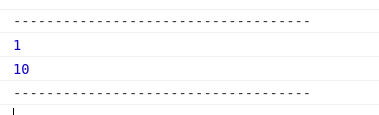

# Fizz Buzz

## concept

給定一個數字 num，
輸出 1~ num，
但是遇到 3 的倍數時輸出 `Fizz`，
遇到 5 的倍數時輸出 `Buzz`，
遇到既是 3 又是 5 的倍數時輸出 `FizzBuzz`

## modulus operator

```javascript
console.log('------------------------------------');
console.log(7 % 3);
console.log(100 % 30);
console.log('------------------------------------');
```



## example code

```javascript
const fizzbuzz = num => {
    for (let i = 1; i <= num; i++) {
        const is3n = i % 3 === 0;
        const is5n = i % 5 === 0;
        if (is3n && is5n) console.log(`FizzBuzz`);
        else if (is3n) console.log(`Fizz`);
        else if (is5n) console.log(`Buzz`);
        else console.log(i);
    }
};

fizzbuzz(20);
```

<iframe
     src="https://codesandbox.io/embed/jovial-violet-5ztqd?fontsize=14&hidenavigation=1&theme=dark"
     style="width:100%; height:500px; border:0; border-radius: 4px; overflow:hidden;"
     title="fizzbuzz"
     allow="geolocation; microphone; camera; midi; vr; accelerometer; gyroscope; payment; ambient-light-sensor; encrypted-media; usb"
     sandbox="allow-modals allow-forms allow-popups allow-scripts allow-same-origin"
   ></iframe>

