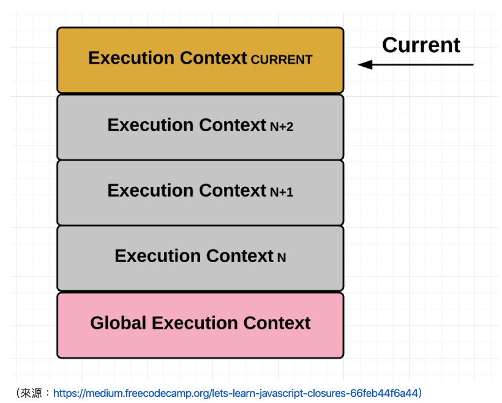

# Hoisting in JavaScript

> Hoisting is JavaScript's default behavior of moving declarations to the top.

## 範例
```javascript
b():
console.log(a);

var a = "hello world";

function b(){
    console.log("Called b);
}
```

輸出結果：


hoisting 在JavaScript中，它會把定義的變項移到最前面先執行。

結果當中並沒有出現任何的錯誤！因為它其實在程式一開始執行的時候，就已經把var a 和function b(){....}這些宣告(declare)的變項都存在記憶體中了，但是還沒把值指定進去a這個變項當中，這使得 a 得到了 undefined的結果（註： undefined 在 JavaScript 並不是真正的 undefined，它其實也是一個值(value)，而且是一個特殊值）。

## 「宣告」與「給值」是分開的

在我們定義變項的過程中，可以分成宣告(declaration)和給值(initialization)的兩個過程，只有declaration的內容會在逐行執行程式前先被執行並儲存在記憶體中(hoisted)；給值的內容則是在hoisted後，逐行執行程式時，才會被執行到。

> JavaScript Declarations are Hoisted  
> JavaScript Initializations are Not Hoisted

## ECMAScript 規範

### Execution Contexts

Execution Contexts（簡稱 EC），  
每當你進入一個 function 的時候，就會產生一個 EC，  
裡面儲存跟這個 function 有關的一些資訊，  
並且把這個 EC 放到 stack 裡面，  
當 function 執行完以後，  
就會把 EC 給 pop 出來。



### Variable Object

每個 EC 都會有相對應的 variable object（以下簡稱 VO），  
在裡面宣告的變數跟函式都會被加進 VO 裡面，  
如果是 function，那參數也會被加到 VO 裡。

### EC 準備 VO 階段

當我們在進入一個 EC 的時候（可以想像成是在執行 function 後的瞬間，在還沒開始跑 function 實際程式碼之前），會按照順序做以下三件事：

1. 把參數放到 VO 裡面並設定好值，傳什麼進來就是什麼，沒有值的設成 undefined
2. 把 function 宣告放到 VO 裡，**如果已經有同名的就覆蓋掉**
3. 把變數宣告放到 VO 裡，**如果已經有同名的則忽略**

所以

```javascript
function test(v, a){
  function a(){}
  console.log(v) // 10
  console.log(a) // function ...
  
  var v = 3
  console.log(v) // 3
}
test(10, 100)
```

## References

[我知道你懂 hoisting，可是你瞭解到多深？ · Issue #34 · aszx87410/blog](https://github.com/aszx87410/blog/issues/34) 