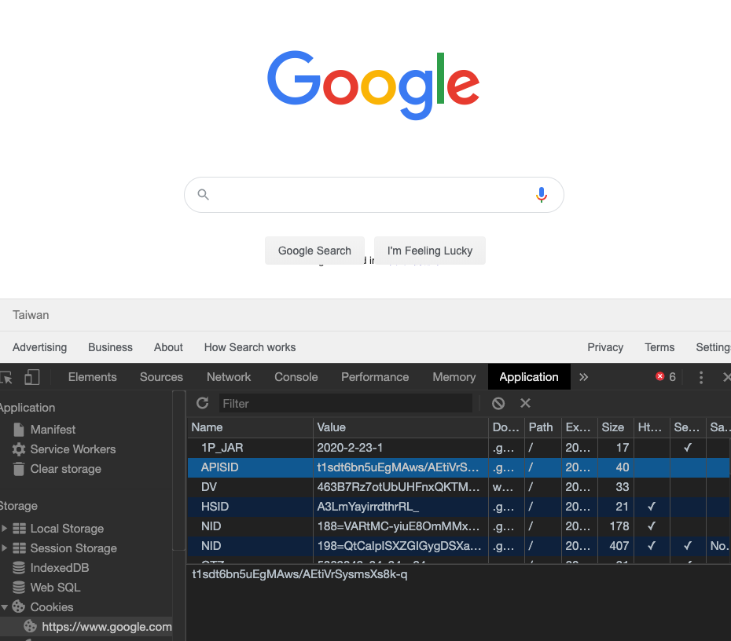
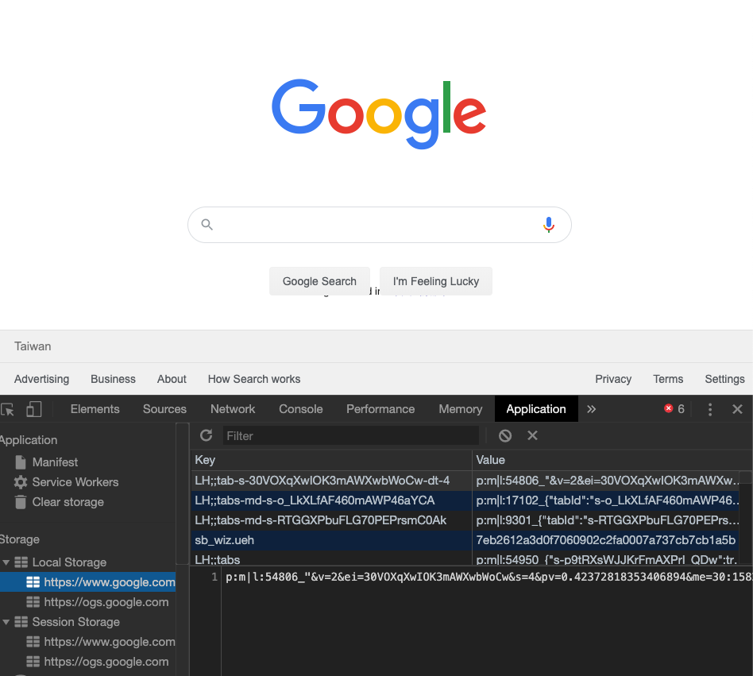

# Cookie, Session, LocalStorage 差異

Server 端要存資料在瀏覽器端的三種方式。

## Cookie

- Server 在 response 中利用 `set-cookie` 存在瀏覽器上，可以同時設定失效時間
- 瀏覽器會在接下來每一次送 request 到相同 domain name 時自動帶上 Cookie
- 最常被用來保持使用者的登入狀態
- 大小限制約 4kb，每個 domain 可以存的容量有限制 ，各瀏覽器不同

# Web Storage API

localStorage, sessionStorage 是在 HTML5 新增的瀏覽器資料儲存解決方案，  

為了解決 Cookie 一些已知的缺點

1. 容量小,
2. 每次傳送都要夾帶，Cookie 過多後的性能問題

所以後來提出的 localStorage, sessionStorage 就有了幾個特點：

- 容量有 5 mb
- 不會每次 request 都夾帶

### API 介面

 localStorage, sessionStorage 為相同的 API 介面, [Web Storage API - Web APIs | MDN](https://developer.mozilla.org/en-US/docs/Web/API/Web_Storage_API)

- 存入資料：`localStorage.setItem(key, value)`
- 取得資料：`let storageValue = localStorage.getItem(key, value)`
- 刪除資料：`localStorage.removeItem(key)`
- 刪除全部資料：`localStorage.clear()`
- value 必須用 `JSON.stringify ` 轉成 `String` 存入，用 `JSON.parse` 轉 `Object `取出

相異之處：

### localStorage

存在 localStorage 的資料不會主動過期，  
除非被刪除。

### sessionStorage

生命週期存在於單一分頁，  
關閉分頁後該分頁的 sessionStorage 就會被清除。  
若是另開新分頁的話，  
新分頁會有一個獨立的新 sessionStorage。

## 應用場景

### user session

- 帳號登入狀態
- 購物車

### 個人化

- user setting, theme

### 追蹤

- user behavior tracking

## References

[cookie、session、local storage、session storage 差異 | Jimmy's Blog](https://jimmywei01.github.io/2019/05/14/cookie%E3%80%81session%E3%80%81local-storage%E3%80%81session-storage-%E5%B7%AE%E7%95%B0/)

[Web Storage API - Web APIs | MDN](https://developer.mozilla.org/en-US/docs/Web/API/Web_Storage_API)

