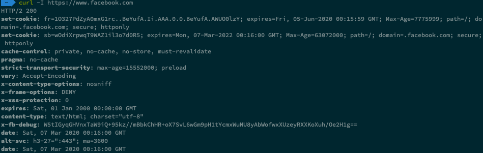
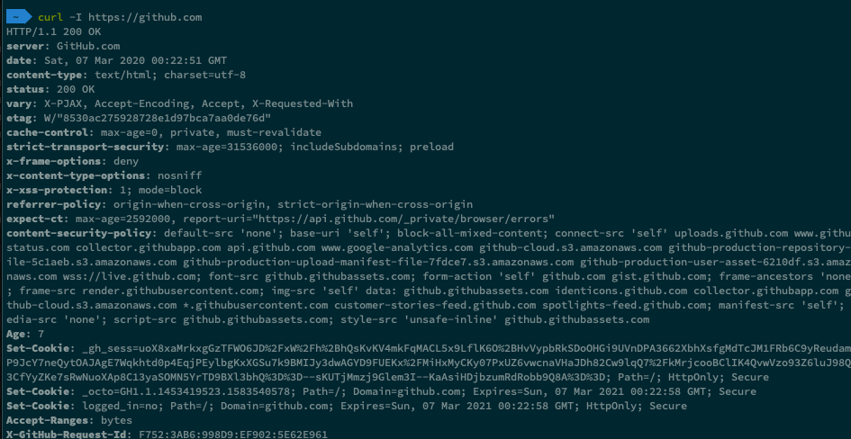

# HTTP Security

## 資安相關的 HTTP headers 

網站伺服器設定可以加上一些資安相關的 HTTP headers，
這樣瀏覽器在收到 response 時就會執行相對應的防護機制。

- 防禦 XSS (Cross Site Scripting)：
  - Content-Security-Policy
  - Set-Cookie: HttpOnly
  - X-XSS-Protection
  - X-Download-Options
- 防禦 Clickjacking：
  - X-Frame-Options
- 強化 HTTPS 機制：
  - Set-Cookie: Secure
  - Strict-Transport-Security
- 避免瀏覽器誤判文件形態：
  - X-Content-Type-Options
- 保護網站資源別被任意存取：
  - Access-Control-Allow-Origin
  - X-Permitted-Cross-Domain-Policies

## 加強安全性的 Cookie 屬性

### HttpOnly

防止 Cookie 被 JavaScript 存取，  
設定 HttpOnly 是為了防止 XSS 在取得客戶端 Cookie

### Secure

Cookie 只在 HTTPS 傳送，  
防止因為被竊聽封包而洩漏 Cookie 的風險

## Session 防護

伺服器如何辨識使用者？在瀏覽器利用 Cookie 保存 SessionID

### SessionID 風險

Cookie 既然都是存在瀏覽器，  
就有被竊的風險，  
最常見的就是使用 XSS。

在瀏覽器 Cookie 中留存 SessionID 可以想像成是一張 `會員卡`，  
攻擊者使用 XSS 偷走你的會員卡，  
並使用你的會員卡進入某些網站。

### 防護措施

- 禁止使用 GET 傳遞 SessionID
- 設定 HttpOnly, Secure
- 同一 Session 中，使用者的 IP 或 User-Agent 改變就清除 Session

 ## Content-Security-Policy

防止 XSS

## 目的

- 宣告載入資源白名單 
- 禁止 inline 程式碼
- 禁止 eval 程式碼
- 防止 sniffer

參考 [Content-Security-Policy - HTTP Headers 的資安議題 (2) | DEVCORE 戴夫寇爾](https://devco.re/blog/2014/04/08/security-issues-of-http-headers-2-content-security-policy/)

## References

[HTTP Headers 的資安議題 (1) | DEVCORE 戴夫寇爾](https://devco.re/blog/2014/03/10/security-issues-of-http-headers-1/) 

[HTTP Session 攻擊與防護 | DEVCORE 戴夫寇爾](https://devco.re/blog/2014/06/03/http-session-protection/)