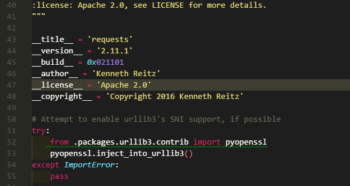
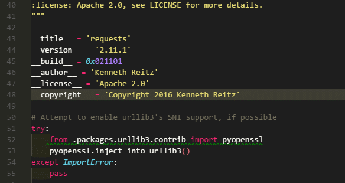
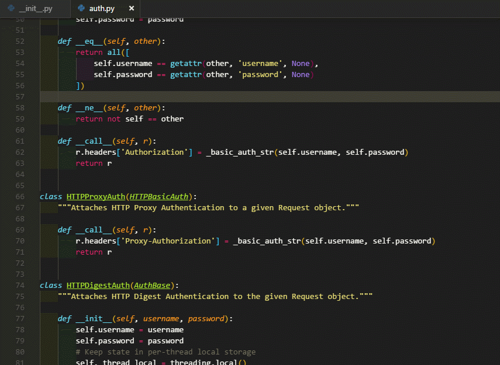

# Visual Studio Code
## F1 或 Ctrl + shift +p 開啟命令面板

`Ctrl + Shift + P` 或 `F1`

在這個命令框裡可以執行 VSCode的任何一條命令，可以查看每條命令對應的快捷鍵，甚至可以關閉這個編輯器。

按下`Backspace`會進入`Ctrl + P`模式。
## Ctrl + P 模式
+ 直接輸入文件名，快速打開文件
+ ? 列出當前可執行的動作
+ ! 顯示Errors或Warnings，也可以Ctrl+Shift+M
+ : 跳轉到行數，也可以Ctrl+G直接進入
+ @ 跳轉到symbol（搜索變量或者函數），也可以Ctrl+Shift+O直接進入
+ @:根據分類跳轉symbol，查找屬性或函數，也可以Ctrl+Shift+O後輸入:進入

在`Ctrl+P`下輸入>又可以回到主命令框 `Ctrl+Shift+P`模式。

## Ctrl + C 複製當前行或選中內容

## Alt + ↓ or ↑ 上下移動當前行

## Shift+Alt + ↓ / ↑ 複製當前行並上下移動

## Ctrl+Enter 在下一行插入光標

## Ctrl+Shift+Enter 在上一行插入光標

## Home 跳到當前行的開始

## End 跳到當前行的末尾

## Ctrl+Home 跳到當前文件的開始

## Ctrl+End 跳到當前文件的末尾

## Ctrl+↑ / ↓ 上下滑動滾動條

## Alt+Click 插入光標

## Ctrl+F2 在所有選中單詞後面添加光標

