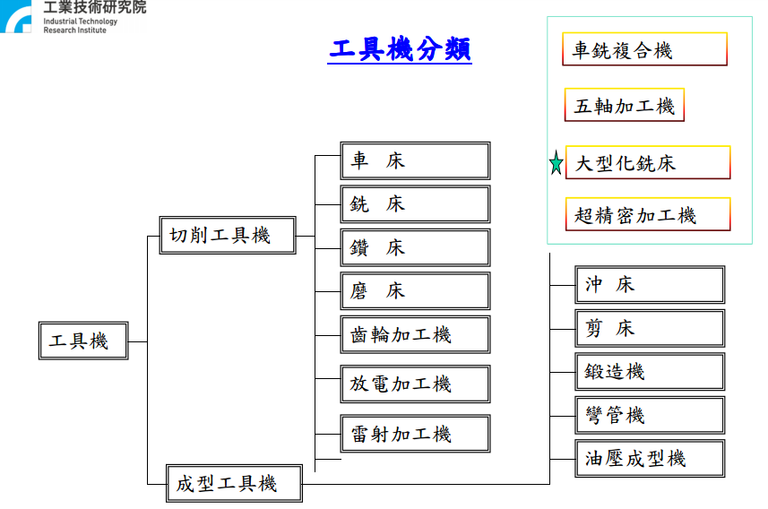
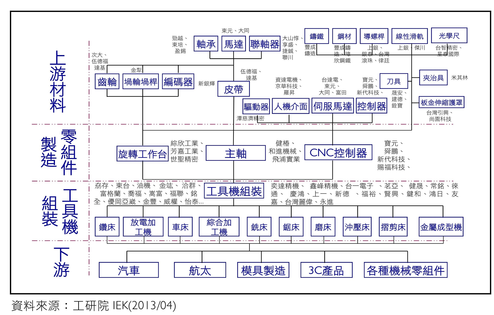
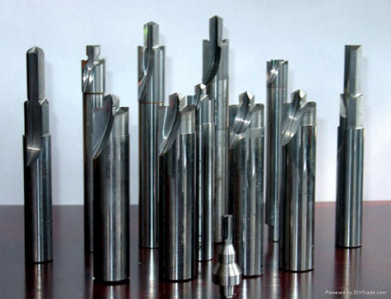

# 金屬玻璃鍍膜在工具機產業的應用機會

## 工具機產業簡介

### 工具機分類

### 我國工具機產業結構

### 總結

液態金屬鍍膜的潛在市場應該有兩處

1. 螺稈與滑軌等，可應用液態金屬鍍膜降低摩擦力，增進運作效率。
2. 各類銑削刀具，作為刀具塗層來增加強度與增進效率。

## 螺稈與滑軌之主要原料供應商

### NSK 日本精工

NIPPON  SEIKO 日本精工株式會社（NSK , http://www.nsk.com）創立於1916年，是日本最早開始著手於軸承生產之軸承製造廠，目前則為全日本最大、世界最大軸承製造業者之一。

**台灣安士克精密股份有限公司**(http://www.tw.nsk.com)為日本 NSK 在台灣之現地法人。
台北市104松江路87號11樓

###  THK

公司的旗艦產品是在軌道上行進的可移動零件和螺桿，稱為 [直線運動導軌](https://zh.wikipedia.org/wiki/LM_%E6%BB%9A%E5%8A%A8%E5%AF%BC%E8%BD%A8)

**台灣帝業技凱股份有限公司** （www.thk.com/?q=tw）為日本 THK 在台灣之現地法人。
台北市士林區承德路四段192-1號7樓

### 上銀

上銀科技股份有限公司，主要從事精密滾珠螺桿及線性傳動元件研發與製造、工業用機器人的研發與製造，為全球第三大滾珠螺桿廠和線性滑軌廠，僅次於日本[THK](https://www.moneydj.com/KMDJ/wiki/WikiViewer.aspx?Title=THK)、[NSK](https://www.moneydj.com/KMDJ/wiki/WikiViewer.aspx?Title=NSK)。

台中市精密機械園區精科路7號

### 銀泰

成立於西元1990年，主要生產滾珠導螺桿、線性導軌及線性模組，係為精密機械關鍵性零組件。

台中市神岡區大富路20巷71號

### 總結

螺稈與滑軌目前的鍍膜方式與材料還須確認。若要尋求合作可能以純台灣企業（上銀與銀泰）比較方便聯絡與接洽。

## 銑削刀具

由於高速切削與高轉速，優良的刀具除了選用兼具耐磨性和高強度韌性的先進材料外，採用鍍膜技術可有效提高切削刀具使用壽命，使刀具獲得優良的整體機械性能，從而大幅度提高機械加工效率。

台灣刀具廠商分為：進口代理（歐洲、日本生產之刀具）與自行生產兩類，普遍皆是中小企業。

 
### 建德刀具有限公司

建德刀具有限公司 優質鎢鋼切削工具專業代理
總公司：台北市大同區承德路二段 12 號 6 樓　|　電話：02-2555-2876　|　傳真：02-2556-8046
代理品牌：KORLOY, DINOX, MIRCONA, YESTOOL, BECKER, CUTWELL

### 正河源機械配件有限公司

刀桿 / 刀具 / 刀片的專業製造廠商
台灣台中市清水區高美路 231 巷 15 號 
TEL: 886-4-26265252 FAX: 886-4-26267941

## 參考資料

http://dmlab.nchu.edu.tw/IMT/uiyroijdfliliilllisdsalidliaygjhbksja/teach/103-1/0916/20140916.pdf
https://www.stockfeel.com.tw/鮮為人知的「機械之母」─工具機/
http://www.mirdc.org.tw/FileDownLoad/EpaperFile/2/38/MPNEWS/text/9704_2_itis04.pdf
http://www.twword.com/wiki/刀具